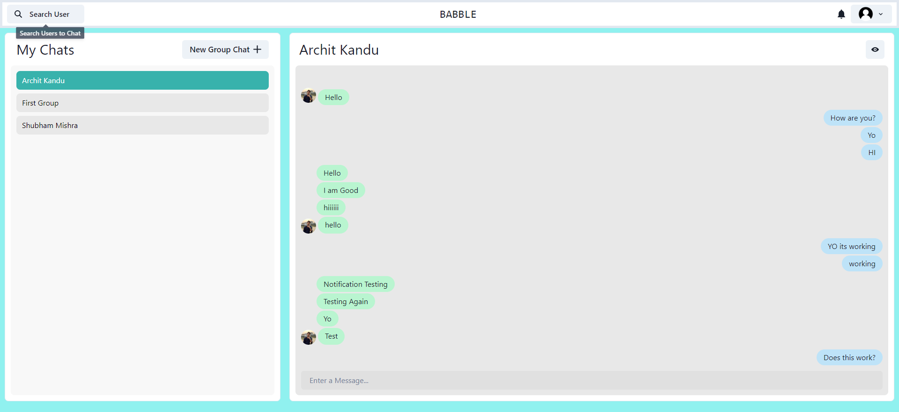

# Babble - MERN Stack Chat Application

## Table of Contents

- [Demo](#demo)
- [Features](#features)
- [Technologies](#technologies)
- [Installation](#installation)
- [Usage](#usage)
- [Contributing](#contributing)

## Demo

- Login/Signup Page:
  

- Single Chat:
  

- Group Chats:
  

- User Profile:
  

## Features

- User Registration and Authentication
- Create and Join Chat Rooms
- Real-time Chat with WebSocket Integration
- User Profiles with Avatars
- Emoji Support for Fun Conversations
- Search for Users and Chat Rooms
- Mobile Responsive Design
- ...and more!

## Technologies

- **Frontend**: React, Chakra UI, Socket.io-client
- **Backend**: Node.js, Express.js, Socket.io
- **Database**: MongoDB
- **Authentication**: JSON Web Tokens (JWT)
- **Cloud Storage**: Cloudinary (for avatars)

## Installation

1. Clone the repository:

   ```bash
   git clone https://github.com/ArchitKandu/Babble.git
   cd babble
   ```


     cd Babble
     npm start
     ```
   - Client:
     ```bash
     cd frontend
     npm start
     ```

6. Open your browser and access the app at http://localhost:3000

## Usage

- Register an account or log in.
- Create a chat room or join an existing one.
- Start chatting in real-time with other users.
- Explore other features like user search, avatars, and more.
